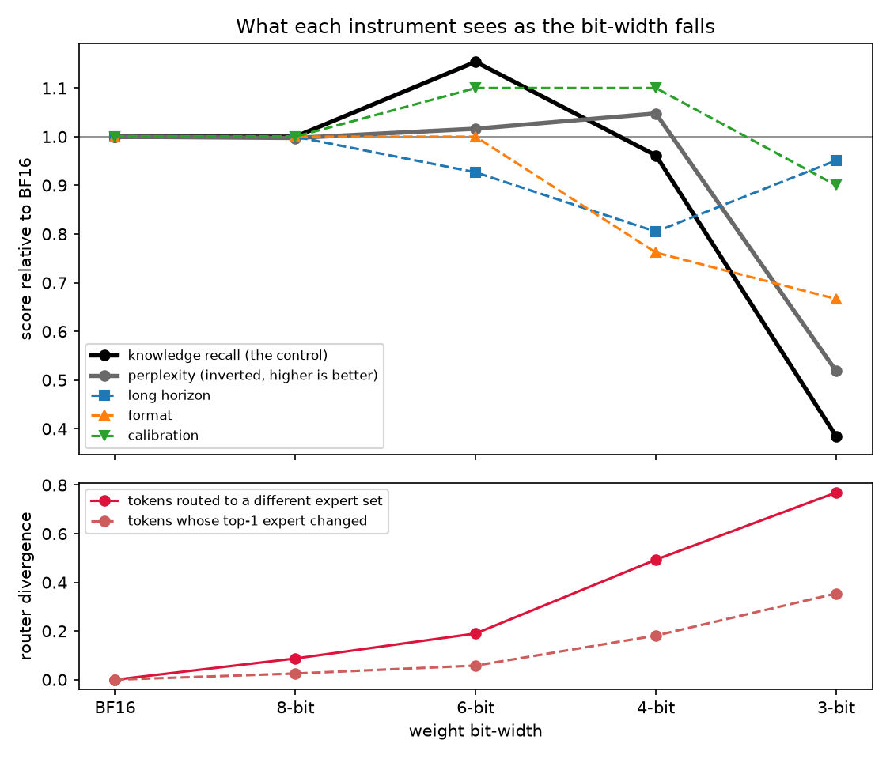
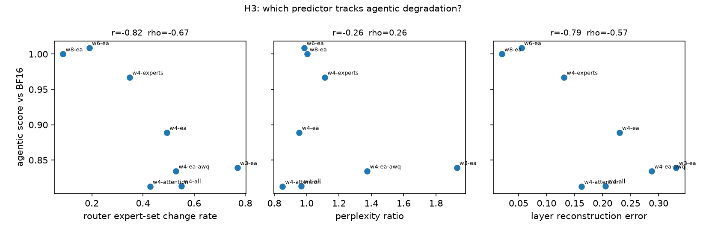

# Results

What ran, where, and what it does and does not support.

**Subject:** `ibm-granite/granite-3.0-1b-a400m-instruct` — a real trained MoE, 24 layers, 32 experts, top-8, 1.3B total parameters. **Hardware:** one 16GB M4 laptop, MPS. Nine configs, ~70 minutes.

The 30B-class subjects the method specifies — Sarvam 30B, Nemotron 3 Nano 30B, gpt-oss-20b — do not fit in 16GB. The instrumentation is verified against their real architectures (see the compatibility table in the README), and `sweep.py` runs them unchanged on a GPU box. Everything below is measured on the 1.3B subject and should be read as a pipeline result at small scale, not as the headline claim.

**Measured:** 100 probe items per config, 794 calibration tokens through 24 gates (≈19k routing decisions per config), perplexity, decoder-layer reconstruction error, and quantized-weight error.

---

## The crossing point exists, and perplexity crosses it backwards



| config | perplexity | recall (control) | long-horizon | format | tokens re-routed |
|---|---|---|---|---|---|
| BF16 | 27.65 | 1.000 | 1.000 | 1.000 | — |
| W8 | 27.72 | 1.000 | 1.000 | 1.000 | 8.7% |
| W6 | 27.21 | 1.154 | 0.927 | 1.000 | 19.0% |
| **W4** | **26.39** | **0.962** | **0.805** | **0.762** | **49.3%** |
| W3 | 53.33 | 0.385 | 0.951 | 0.667 | 76.9% |

At 4-bit, **perplexity improved by 4.6% while format stability fell 24% and long-horizon instruction adherence fell 19%**, and half of all tokens were routed to a different expert set. The control probe moved 4%. Both instruments a practitioner would actually consult said the model was fine; two of the four agentic probes said it was not.

Only at 3-bit do the aggregate measures finally react — and there they collapse hardest of all (recall −62%, perplexity 1.9×), which is the point: they are sensitive in the region where nobody deploys and insensitive in the region where everybody does.

**H1 holds** on this subject: degradation is capability-specific, not uniform. **H2 holds**: there is a bit-width at which the aggregate reading is flat and agentic capability has already fallen materially. Here that width is 4, the most widely deployed one.

## H3 — router divergence beats perplexity, and ties with reconstruction error



| predictor | pearson r | spearman rho |
|---|---|---|
| **router expert-set change rate** | **−0.821** | −0.667 |
| layer reconstruction error | −0.794 | −0.571 |
| router top-1 flip rate | −0.773 | −0.667 |
| router top-k jaccard | −0.748 | −0.667 |
| expert load KL | −0.432 | −0.667 |
| perplexity ratio | −0.257 | +0.262 |

Router divergence beats perplexity decisively (0.82 against 0.26). It does **not** clearly beat per-layer reconstruction error (0.82 against 0.79) — at n=8 configs that gap is noise. The honest verdict is that H3 half-holds: routing predicts what perplexity cannot, but this study does not establish it as the best available cheap predictor. Reconstruction error is the competitor to beat, and beating it needs more configs than a laptop sweep provides.

## Mechanism — the flips are where the router was undecided

The prediction was that quantization flips exactly the tokens sitting near a routing decision boundary. Pairing each margin with the event it governs — the top-1 margin with a change of argmax, the k-th/(k+1)-th margin with a change of the selected set:

| config | top-1 flips, narrow → wide quartile | set changes, narrow → wide |
|---|---|---|
| W8 | **0.100** 0.002 0.000 **0.000** | **0.289** 0.051 0.008 **0.000** |
| W6 | 0.211 0.019 0.002 0.000 | 0.481 0.213 0.059 0.006 |
| W4 | 0.443 0.205 0.066 0.011 | 0.717 0.614 0.462 0.181 |
| W3 | 0.580 0.437 0.295 0.106 | 0.885 0.850 0.778 0.565 |

Monotone in every config, at every bit-width. At 8-bit, a narrow-margin token is *infinitely* more likely to flip than a wide-margin one — 10.0% against 0.0%. This is the mechanism story demonstrated rather than asserted, and it is what licenses the cheap diagnostic: the margin distribution is computable from the base model alone, before any quantized checkpoint exists.

Paired the other way round — the k-boundary margin against top-1 flips — the same data shows a flat profile and no mechanism at all. The pairing is the whole result.

## Component ablation — attention damage is routing damage

| what was quantized to 4-bit | perplexity | long-horizon | format | tokens re-routed | worst layers |
|---|---|---|---|---|---|
| experts only | 30.77 | 0.854 | 1.048 | 34.8% | 12–22 |
| attention only | **23.52** | **0.585** | 0.952 | 42.8% | 4–16 |
| experts + attention | 26.39 | 0.805 | 0.762 | 49.3% | 11–22 |
| all three, router included | 26.72 | 0.683 | 0.857 | 55.0% | 11–19 |

Quantizing **attention alone produced the best perplexity in the entire sweep — 15% better than BF16 — and the worst long-horizon adherence, 41% below baseline.** For a practitioner reading perplexity, that config is the most attractive one on the board. It is the worst one on the board for keeping instructions across a long trajectory.

It also re-routed 42.8% of tokens without touching a single expert or router weight. Routing damage is not only expert damage: the gate reads what attention produced, so degrading attention moves the router's input and changes the computational path. Damage also localises differently — deep layers for expert quantization, early-to-middle layers for attention.

Adding the router itself to the quantization set (`w4-all`) cost a further 5.7 points of re-routing over experts+attention. That is the empirical case for the exemption OpenAI already ships in `gpt-oss-20b`, whose `modules_to_not_convert` keeps `mlp.router` and `self_attn` out of MXFP4.

---

## Threats to validity

Stated in full, because the finding is only worth what survives them.

1. **Scale.** 1.3B parameters, not 30B. Small models have less redundancy, so they should degrade *earlier*; whether the crossing point sits at the same bit-width on a 30B MoE is exactly what this study cannot say.
2. **Statistical power.** 100 probe items, 12–40 per probe. A single item is 2.5–8 percentage points. Single-config deltas are noisy; the monotone trend across the bit sweep is the signal, not any one cell.
3. **Perplexity sample.** 794 calibration tokens. Perplexity moving 5% in either direction at that sample size is weakly determined, though the 1.9× jump at 3-bit is not.
4. **Two probes were at their floor.** `recovery` scored 0.10 at BF16 and `calibration` 0.50, which is exactly what always-answering scores. A 1.3B model cannot do those tasks, so they measure nothing about degradation and are excluded from the agentic mean. H1/H2 here rest on long-horizon adherence and format stability.
5. **Fake quantization.** Round-to-nearest through a quantized grid, not GPTQ or AWQ kernels. It isolates the arithmetic from any one implementation, and it is not what a serving stack runs.
6. **The `awq` config is not AWQ.** It is activation-aware scaling with a fixed alpha and no search. It produced *higher* weight error than plain RTN (0.165 against 0.110 on attention) and worse perplexity. Read it as evidence that method matters at fixed bit-width, not as a result about AWQ.
7. **The control is a proxy.** 40 open-ended recall items, not MMLU. On a GPU box, swap in lm-eval-harness.
8. **n=8 for every correlation.** The H3 table is suggestive, not conclusive.

## What needs a GPU box

The sweep runs unchanged on the real subjects; only the hardware is missing.

```bash
python sweep.py sarvam-30b --vendor --device auto      # + sarvamai/sarvam-30b-fp8
python sweep.py gpt-oss-20b --device auto
python sweep.py nemotron-3-nano-30b --vendor           # needs mamba-ssm, CUDA only
```

`--vendor` sweeps the vendor's own quantized checkpoints — Sarvam's FP8, NVIDIA's FP8 and NVFP4 — rather than faking the arithmetic. Those are the configs serving teams actually deploy, and comparing them against their own BF16 release is the strongest available version of this experiment. Two blockers found while checking: `sarvam-105b`'s bundled modeling code needs transformers < 5, and Nemotron 3 Nano is a hybrid Mamba MoE requiring `mamba-ssm`, which needs CUDA to build.
